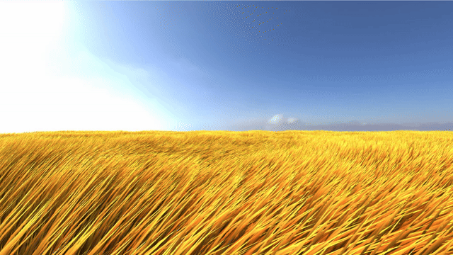

# grass-sim

**Notice**: This app may lag when using Firefox on macOS. It runs normally in Safari and Chrome on macOS, and across all browsers on Windows and Linux.

A real-time grass simulation rendered via WebGL using Three.js, built with React, TypeScript, and Vite. The scene is a noise-displaced heightfield terrain covered by a large field of instanced grass blades that bend and sway in a configurable wind, lit against an HDR environment map and its matching panorama background. Below is a demonstration of this simulation:

<p align="center">
  
</p>

## Overview

This project renders the whole scene on the GPU through Three.js, with custom GLSL shaders for both the terrain and the grass. The terrain is a heightfield displaced by a 2D noise field, and the grass is a grid of tiles where each tile is a single `InstancedMesh` of thousands of blades from a shared blade model. This keeps the draw-call count low and lets WebGL frustum-cull each tile independently.

Both the terrain and the grass are shaded by a single shared lighting model: a hemispherical ambient term, a directional lambertian diffuse term with Blinn-Phong specular highlights, and reflection from the HDR environment map. The grass blades additionally bend in a wind field (driven by velocity, randomness, and direction), evaluated per-blade in the vertex shader each frame.

All settings (wind, grass, terrain, and lighting) are adjustable live in a sidebar while the scene runs, and can be saved as named entries with a snapshot of the render for reloading later.

The technique for this grass field was inspired by the GDC talk _Procedural Grass in 'Ghost of Tsushima'_. See [Resources](#resources) for the talk and its slides.

Finally, this was a learning project for building with React and Three.js, and, along the way, for trying out some coding agents for AI-assisted development.

### Key Features

- **Instanced Grass Field**: Thousands of blade instances per tile in a grid over the terrain, each blade a shared loaded model, so the whole field renders in a handful of draw calls.
- **Vertex-Shader Wind Simulation**: Blades bend and sway from a configurable wind (velocity, randomness, direction) computed per blade on the GPU, every frame.
- **Noise-Displaced Terrain**: A heightfield whose amplitude and frequency are configurable, with the grass placed along the displaced height.
- **Shared HDR Lighting Model**: Hemispherical ambient, lambertian diffuse with Blinn-Phong specular, and environment-map reflection from a single HDR panorama that also serves as the scene background.
- **Live, Per-Frame Settings**: A sidebar drives wind, grass, terrain, and lighting uniforms directly frame-to-frame, with no renderer rebuild.
- **Save/Load Settings**: Named settings entries with a render snapshot, importable and exportable as JSON.
- **First-Person & Touch Controls**: Pointer-locked mouse look with WASD flight on keyboard and mouse devices; orbit-only drag and pinch zoom on touch devices.

## Getting Started

### Prerequisites

To build and run this project, you will need:

- Node.js and npm

### Building and Running

1. Install the dependencies:

   ```bash
   npm install
   ```

2. Run the development server:

   ```bash
   npm run dev # The dev server runs on port 3000 (not Vite's default 5173).
   ```

3. Build the production bundle and serve it locally:

   ```bash
   npm run build   # Runs the TypeScript typecheck (tsc -b), then builds into dist/
   npm run preview
   ```

### Linting, Formatting, and Testing

```bash
npm run lint      # Run ESLint
npm run lint:fix  # Run ESLint and fix issues
npm run format    # Format the codebase with Prettier
npm test          # Run the test suite once (Vitest + React Testing Library)
```

## Usage

The application has two pages, navigated from the navbar:

- **`/simulation`**: The rendered scene alongside the settings sidebar. Collapsible sections expose the wind settings (velocity, randomness, direction), the grass blade (width, height, bending, height randomness, thickening, the two base/tip color palettes and their mix and distribution, shadowing, softness), the terrain (base color, height, noise frequency), and the lighting (hemispherical sky/ground tint, diffuse color and direction, specular shininess and intensity, environment strength). Saving from the sidebar captures a snapshot of the scene and stores the entry by name.
- **`/load-settings`**: The saved entries list, each with its name and render snapshot. Load an entry into the simulation, export it as JSON, import settings from a JSON file, or delete an entry.

The general controls are:

- **Click the scene**: Engage pointer-lock mouse look.
- **Mouse**: Look around while the pointer is locked.
- **WASD**: Move the camera along its line of sight.
- **E / Q**: Raise / lower the camera.
- **Esc**: Release the pointer lock.

On touch devices, the scene uses orbit controls instead: drag to look around, pinch or wheel to zoom, and panning is intentionally disabled.

## Resources

- [Video recording of talk _Procedural Grass in 'Ghost of Tsushima'_](https://www.youtube.com/watch?v=Ibe1JBF5i5Y)
- [Slides of the talk](https://gdcvault.com/play/1027033/Advanced-Graphics-Summit-Procedural-Grass)

## Dependencies

This project uses the following core dependencies, managed via npm:

- [React](https://react.dev/): User interface library.
- [react-router](https://reactrouter.com/): Client-side routing.
- [Three.js](https://threejs.org/): WebGL rendering of the simulation.
- [Zustand](https://github.com/pmndrs/zustand): Shared application state (the active settings and saved entries).
- [Tailwind CSS](https://tailwindcss.com/): Utility-first styling of the UI.
- [Vite](https://vite.dev/): Development server and build tool.

## License

Distributed under the MIT License. See [LICENSE](LICENSE) for more information.
